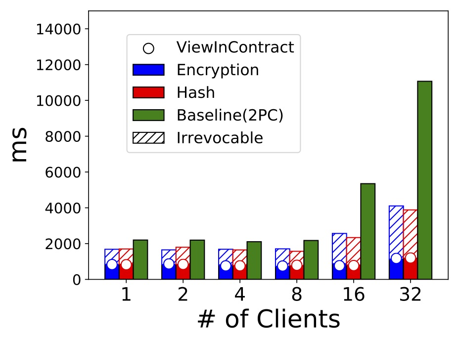
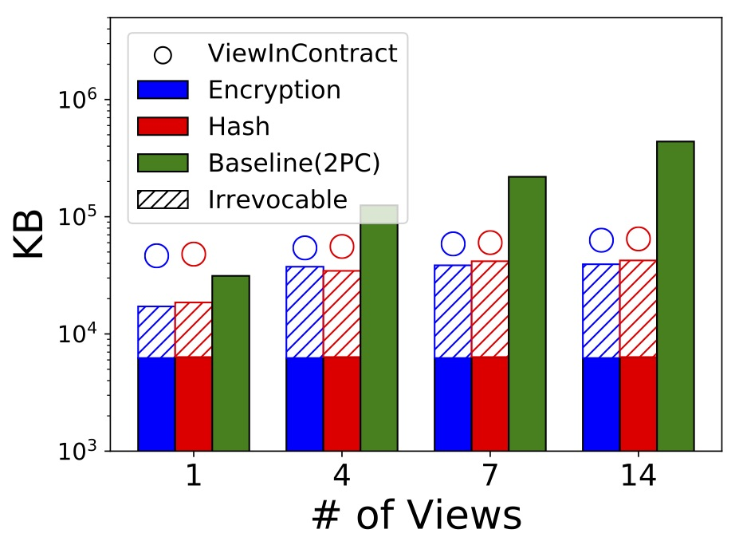
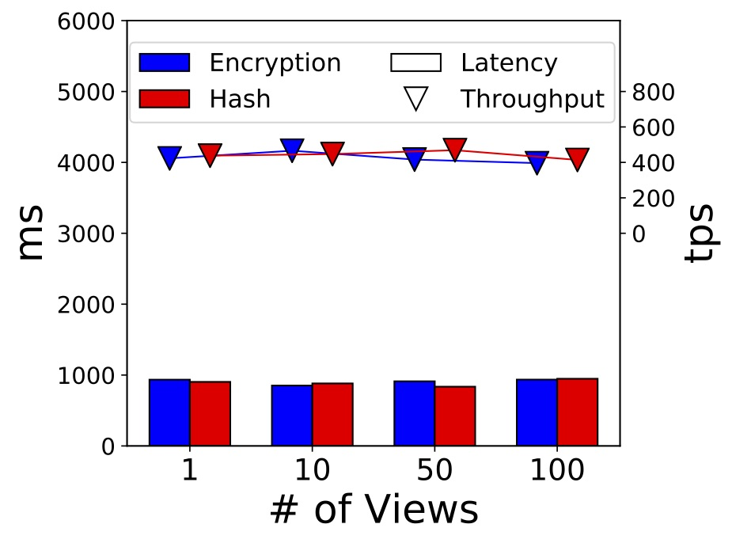
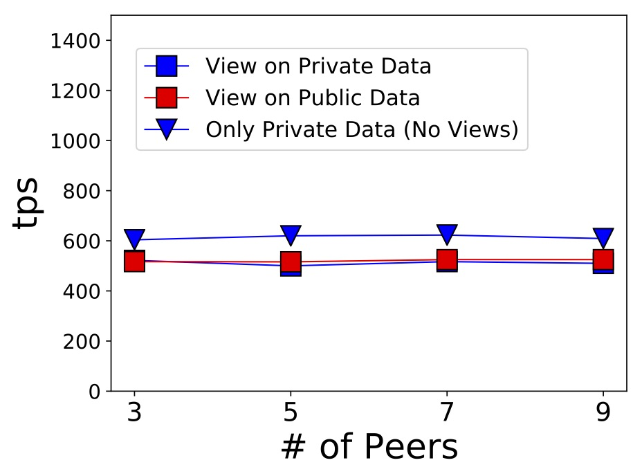
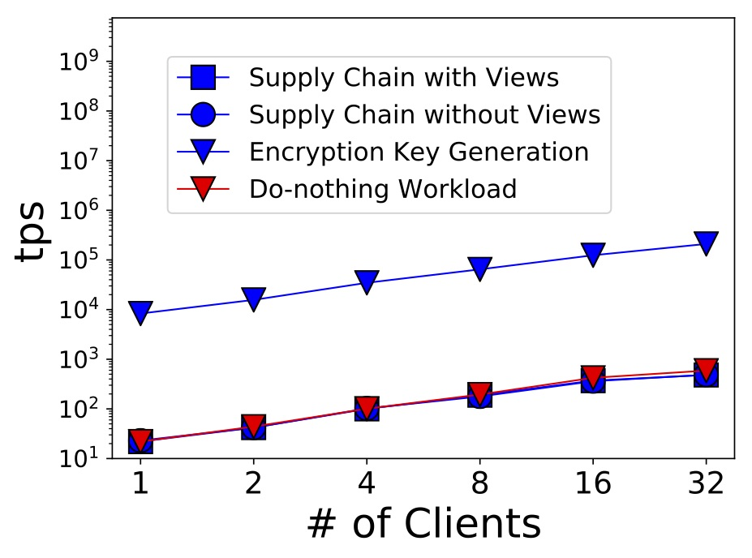

# Overview
The repository demonstrates the implementation of our proposal regarding to the access-control views on blockchains.
And the guide also describes how to reproduces experiments on a Fabric network.
The Fabric blockchain runs in a docker network on a local machine. 
It comprises two peers and a single orderer. 
Two peers are from distinct organizations. 
We strongly advise readers to go through the Fabric official [doc](https://hyperledger-fabric.readthedocs.io/en/latest/test_network.html) first. 
With a enough knowledge on the Fabric network and usage, readers can better understand our guide. 

Below, we lay out the experimental setup, explain the project structure and relate our experimental results to their corresponding scripts. 
__NOTE__: Our later-shown results are actually measured from a on-premise cluster with more-than-two peers and more-than-one orderers, not from a docker network on a local machine. 
Our docker-backed demonstration is for portability. 

# Experimental Setup
## Our Running Environment
```
$ sw_vers
ProductName:	Mac OS X
ProductVersion:	10.14.5
BuildVersion:	18F132

$ go version
go version go1.13.9 darwin/amd64

$ node --version
v13.13.0

$ npm --version
6.14.4

$ docker-compose version
docker-compose version 1.28.5, build c4eb3a1f
docker-py version: 4.4.4
CPython version: 3.9.0
OpenSSL version: OpenSSL 1.1.1h  22 Sep 2020

```

```
$ docker version
Client: Docker Engine - Community
 Version:           19.03.12
 API version:       1.40
 Go version:        go1.13.10
 Git commit:        48a66213fe
 Built:             Mon Jun 22 15:41:33 2020
 OS/Arch:           darwin/amd64
 Experimental:      false

Server: Docker Engine - Community
 Engine:
  Version:          19.03.12
  API version:      1.40 (minimum version 1.12)
  Go version:       go1.13.10
  Git commit:       48a66213fe
  Built:            Mon Jun 22 15:49:27 2020
  OS/Arch:          linux/amd64
  Experimental:     false
 containerd:
  Version:          v1.2.13
  GitCommit:        7ad184331fa3e55e52b890ea95e65ba581ae3429
 runc:
  Version:          1.0.0-rc10
  GitCommit:        dc9208a3303feef5b3839f4323d9beb36df0a9dd
 docker-init:
  Version:          0.18.0
  GitCommit:        fec3683

```

## Preparation (Download Docker Images and Binaries)
```
# Under project root directory
fabric_version="2.2.4"
ca_version="1.5.2"

# According to https://hyperledger-fabric.readthedocs.io/en/release-2.2/install.html,
#   the script will download vendor-specific fabric binaries and docker images
curl -sSL https://bit.ly/2ysbOFE | bash -s -- ${fabric_version} ${ca_version}

# Pull out bin/ with binaries and config/ with config files
cp -r fabric-samples/bin . 
cp -r fabric-samples/config . 

# Make binaries accessible on $PATH
export PATH="$(pwd)/bin:${PATH}"

# Install front end
npm install
```
* This preparation setup only requires for once. 
* Can inspect downloaded docker images with `docker images |grep hyperledger`


# Project Structure
## [test-network/](test-network/) 
The directory contains artifacts and scripts to manage Fabric chains, including spinning up, turning down, creating channels, deploying contracts(chaincodes), and etc. 
They are utilized in later-mentioned experimental bash scripts. 

Example usage: 
```
# Under test-network/

# To spin up the network
./network.sh up

CHANNEL_NAME="viewchannel"
./network.sh createChannel -c ${CHANNEL_NAME}

# To turn off
./network.sh down
```

## [chaincodes/](chaincodes)
The directory contains smart contracts (chaincodes) to be deployed on Fabric. 

* [txncoordinator.go](chaincodes/txncoordinator/txncoordinator.go): a smart contract that coordinates the cross-chain Two-phase Commit. 
* [viewstorage.go](chaincodes/viewstorage/viewstorage.go): a smart contract to store the view data, exclusive for Irrevocable views. 

The below contracts share a common function with signature `InvokeTxn(ctx contractapi.TransactionContextInterface, pub_arg, private_arg string)`.
This is the execution entry for workload transactions, i.e., the supply chain. The `pub_arg` is for the non-secret part of a transaction, whereas `private_arg` for the processed secret part. The secret part is either hash-hidden, encryption-hidden, or plain without any protection.

* [noop.go](chaincodes/noop/noop.go): a smart contract that performs no data processing, used to evaluate the Fabric's raw throughput. 
* [onchainview.go](chaincodes/onchainview/onchainview.go): a smart contract that implements the paper-mentioned _ViewInContract_ for the supply chain workload. A transaction's processed secret part is stored as the __Fabric Public Data__. 
* [privateonchainview.go](chaincodes/privateonchainview/privateonchainview.go): a smart contract that implements the paper-mentioned _ViewInContract_ for the supply chain workload. A transaction's processed secret part is stored as the __Fabric Private Data__. 
* [secretcontract.go](chaincodes/secretcontract/secretcontract.go): a smart contract for the supply chain workload only, without in-contract access-controlled views. The transaction's secret part is stored as the __Fabric Public Data__. 
* [privateonly.go](chaincodes/privateonly/privateonly.go): a smart contract for the supply chain workload only, without in-contract access-controlled views. The transaction's secret part is stored as the __Fabric Private Data__. 

### Scripts to Deploy a Contract(Chaincode)
```
# Under test-network/
CC_NAME="noop" # Can also be txncoordinator, privateonly, ..., etc.

PEER_COUNT=2
ALL_ORG=""
for i in $(seq ${PEER_COUNT})
do
   ALL_ORG="$ALL_ORG 'Org${i}MSP.peer'"
done

function join_by { local d=$1; shift; local f=$1; shift; printf %s "$f" "${@/#/$d}"; }

ENDORSE_POLICY="OR($(join_by , $ALL_ORG))" # Result into "OR(Org1MSP.peer,Org2MSP.peer)"

./network.sh deployCC -c ${CHANNEL_NAME} -ccl go -ccn ${CC_NAME} -ccp ../chaincodes/${CC_NAME} -ccep ${ENDORSE_POLICY} -cccg ../chaincodes/${CC_NAME}/collection_config.json
```
## [app/](app/)
The directory contains NodeJS codes that implement the access-controlled views on blockchains. They are : 
* [crypto_mgr.js](app/crypto_mgr.js): a module with cryptographic primitives, such as hash operations, asymmetric encryptions, and etc. 
* [fabric_front.js](app/fabricfront.js): a module that interacts with contracts and Fabric instances. 
* [front_demo.js](app/front_demo.js): a demo that showcases `front_front`'s interactions. The demo assumes the `test-network` is on, the channel named `viewchannel` is created and the contract `noop.go` is deployed. 
* [global.js](app/global.js): a module that groups all global variables. 

The above modules provide low-level operations for below modules. For example, `encryption_based_view_mgr` requires `fabric_front` to interact with chaincodes. 

* [encryption_based_view_mgr.js](app/encryption_based_view_mgr.js): a module that implements Encryption-based views. It supports `Revocable`, `Irrevocable`, and `ViewInContract` modes, all of which the paper has discussed. Besides, it support `MockFabric` mode. In `MockFabric` mode, `fabric_front` is substituted with a fake one that intercepts all blockchain interactions. It is used in an [experiment](#exp) to measure the encryption key generation speed, without the blockchain overheads.
* [hash_based_view_mgr.js](app/hash_based_view_mgr.js): a module that implements Hash-based views. It supports `Revocable`, `Irrevocable`, and `ViewInContract` modes. 
* [plain_view_mgr.js](app/plain_view_mgr.js): a module that does not hide the transaction's secret part and directly invoke the transaction with the uncovered secret part. (The uncovered secret part may be protected by Fabric built-in Private Data) It supports `ViewInContract` and `OnlyWorkload`  mode. In `OnlyWorkload`  mode, the module skips all view manipulations, such as view creation or appending operations. It is to measure the workload throughput solely, without incurring view management overheads. 
* [view_demo.js](app/view_demo.js): a minimum viable prototype that showcases a complete management lifecycle of an Encryption-based View with `Revocable` mode. The view involves a single transaction. The demo also comments how to work with other view schemes or modes. 

## [exp/](exp/)
The directory contains logs, results, workloads, scripts for experiments. 
Scripts are a mix of NodeJS scripts and bash scripts. 

A NodeJS script constitutes a client driver, which a bash script invokes into a number of client processes. 
The NodeJS scripts builds upon the modules in [app/](app/). 

NodeJS Scripts: 
* [ledger_storage.js](exp/ledger_storage.js): a script to measure the chain storage size in bytes. 
* [perf_viewincontract.js](exp/perf_viewincontract.js): a script to measure `ViewInContract`-mode performance with varying numbers of views and transaction selectivity. There are two options in selectivityy. If _ALL_, a transaction falls into all views. If _single_, it falls into a random view. 
* [two_phase_mgr.js](exp/two_phase_mgr.js): a script that commits a request with Two-phase Commit across multiple involved chains. 
* [supplychain_2pc.js](exp/supplychain_2pc.js): a script that runs the supply chain workload with the baseline two-phase-commit approach, as coded in `two_phase_mgr`. 
* [supplychain_view.js](exp/supplychain_view.js): a script that runs the supply chain workload with access controlled views, with configurable schemes (Encryption/Hash) and modes(Revocable/Irrevocable/ViewInContract). 
* [verify_viewincontract.js](exp/verify_viewincontract.js): a script that measures delays for verifying a view's soundness and completeness. 

Each bash script performs an end-to-end experiment. Each shares a common pattern. It firstly spins up the network, creates the channel, deploys relevant contracts, invokes NodeJS client programs, aggregates results from client processes, and turns down the network. 
For each experimental run, the aggregated results and the logs of all client processes will be persisted under the date-named subdirectory of [exp/result](exp/result) and [exp/log](exp/log) respectively. The results and log files are named with unique identifiers determined from experimental parameters. 
We will explain bash scripts in later sections. 

# From Experimental Results to Bash Scripts
Below mentioned commands run with `exp/` as the working directory. 
## Throughput of the Supply Chain Workload with Varying Number of Clients. 

* Figures other than _Baseline(2PC)_ are collected from _Total Thruput(tps)_ field from each aggregated result file, generated from command `./view_perf_end2end.sh workload/batch_100items_25batchsize.json`. 
* Figures of _Baseline(2PC)_ are collected from _Total Thruput(tps)_ field from each aggregated result file, generated from command `./2pc_perf_end2end.sh workload/batch_100items_25batchsize.json`.

## Latency of the Supply Chain Workload with Varying Number of Clients. 

* Figures other than _Baseline(2PC)_ are collected from _Batch Delay(ms)_ field from each aggregated result file, generated from command `./view_perf_end2end.sh workload/batch_100items_25batchsize.json`. 
* Figures of _Baseline(2PC)_ are collected from _Batch Delay(ms)_ field from each aggregated result file, generated from command `./2pc_perf_end2end.sh workload/batch_100items_25batchsize.json`.

## Ledger Storage of the Supply Chain Workload with Varying Number of Views. 

* Figures other than _Baseline(2PC)_ are collected from _Ledger Size (Bytes):_ field of the aggregated result file, generated from command `./view_storage.sh workload/batch_100items_25batchsize.json`. 
* Figures of _Baseline(2PC)_ are collected from _Ledger Size (Bytes):_ field of the aggregated result file, generated from command `./2pc_storage.sh workload/batch_100items_25batchsize.json`. 

__NOTE__: [2pc_perf_end2end.sh](exp/2pc_perf_end2end.sh) and [2pc_storage.sh](exp/2pc_storage.sh) are not fully fledged, as they only work on a single chain as specified in `test-network`. In real experiments, the number of running chains should be set to equal to the specified number of views, i.e., one chain for one view. In scripts, we specify how to edit the code to work with multiple chains. 

## Performance of ViewInContract mode With Varying Number of Views
### Selectivity : ALL

Throughputs and latencys are similarly collected like above, but from result files generated by command `./viewincontract_perf.sh all`

### Selectivity : Single

Throughputs and latencys are similarly collected like above, but from result files generated by command `./viewincontract_perf.sh single`

## Latency of View Verification with Varying Number of Transactions

Running command `./verify_viewincontract.sh`
In each generated result file, last few lines are like: 
> Scan $A$ $B$-batch transactions in $C$ ms ( remote query in $D$ ms, verify in $E$ ms )

> Scan $E$ blocks in $F$ ms ( remote query in $G$ ms, verify in $H$ ms ) 

Figures in the chart is collected as below: $D$ and $E$ respectively stand for _Chain Query_ and _Local Computation_ of _Soundness_, whereas $G$ and $H$ for _Completeness_'s _Chain Query_ and _Local Computation_.

## Throughputs of the Supply Chain Workload in ViewInContract mode with Varying Number of Peers

Running command `./view_scalability.sh workload/batch_100items_25batchsize.json`

With respect to ths script and the chart, 
* The results from `run_exp ${workload_file}  "${ENCRYPTION_SCHEME}" "onchainview" ${peer_count}` corresponds to _View On Public Data_ curve. 
* The results from `run_exp ${workload_file} "${PLAIN_SCHEME}" "privateonchainview" ${peer_count}` corresponds to _View On Private Data_ curve. 
* The results from `run_exp ${workload_file} "${PLAIN_SCHEME}" "privateonly" ${peer_count}` corresponds to _Only Private Data (No Views)_ curve. 

__NOTE__: The script is not fully fledged, as it only assumes a chain of two peers under `test-network`. In real experiments, readers shall set up Fabric networks with 3, 5, 7, and 9 peers. In the script, we specify where to edit to work with a chain of more-than-two peers. The current script will panic if executes directly. 

## Thoughput Comparison with Varying Number of Clients. {#exp}


Running command `./view_perf_breakdown.sh workload/batch_100items_25batchsize.json`

With respect to ths script and the chart, 
* The results from `run_exp ${workload_file} "${ENCRYPTION_SCHEME}" "${VIEWINCONTRACT_MODE}" "onchainview" ${client_count}` corresponds to _Supply Chain with Views_ curve. 
* The results from `run_exp ${workload_file} "${ENCRYPTION_SCHEME}" "${MOCK_MODE}" "onchainview" ${client_count}` corresponds to _Encryption Key Generation_ curve. 
* The results from `run_exp ${workload_file} "${PLAIN_SCHEME}" "${ONLYWORKLOAD_MODE}" "secretcontract" ${client_count}` corresponds to _Supply Chain without Views_ curve. 
* The results from `run_exp ${workload_file} "${PLAIN_SCHEME}" "${ONLYWORKLOAD_MODE}" "noop" ${client_count}` corresponds to _Do-nothing Workload_ curve. 